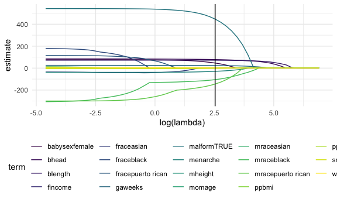

Statistical Learning
================

Load libraries that you will need:

``` r
library(tidyverse)
```

    ## ── Attaching packages ─────────────────────────────────────── tidyverse 1.3.1 ──

    ## ✓ ggplot2 3.3.5     ✓ purrr   0.3.4
    ## ✓ tibble  3.1.3     ✓ dplyr   1.0.7
    ## ✓ tidyr   1.1.3     ✓ stringr 1.4.0
    ## ✓ readr   2.0.1     ✓ forcats 0.5.1

    ## ── Conflicts ────────────────────────────────────────── tidyverse_conflicts() ──
    ## x dplyr::filter() masks stats::filter()
    ## x dplyr::lag()    masks stats::lag()

``` r
library(glmnet)
```

    ## Loading required package: Matrix

    ## 
    ## Attaching package: 'Matrix'

    ## The following objects are masked from 'package:tidyr':
    ## 
    ##     expand, pack, unpack

    ## Loaded glmnet 4.1-2

``` r
set.seed(11)

knitr::opts_chunk$set(
  fig.width = 6,
  fig.asp = .6,
  out.width = "90%"
)

theme_set(theme_minimal() + theme(legend.position = "bottom"))

options(
  ggplot2.continuous.colour = "viridis",
  ggplot2.continuous.fill = "viridis"
)

scale_colour_discrete = scale_colour_viridis_d
scale_fill_discrete = scale_fill_viridis_d
```

## Learning from data

#### Supervised learning

-   There’s an outcome you care about, and what you learn depends on the
    outcome
-   Regression, lasso/elastic net, regression trees, support vector
    machines

#### Unsupervised learning

-   You just have data and want to learn things, probably find patterns,
    identify subgroups
-   Clustering, principal components analysis, factor analysis

## Lasso

#### Regression -&gt; Lasso

-   One drawback of regression is lack of scalability (too many
    covariates)
-   Lasso is useful when you have a lot of coefficients and few strong
    hypotheses
-   Regression is estimated by minimize residual sum of squares
-   Lasso adds a penalty on the sum of all coefficients (favors smaller
    coefficients), essentially balancing goodness of fit with complexity
    of the model
-   Penalized regression forces some coefficients to be 0, which removes
    some covariates from the model

#### Drawbacks of lasso

-   No inference/ p-values
-   Very different interpretatin (if any)
-   Have to choose the tuning parameter (to maximize prediction
    accuracy)

#### Tuning parameter selection

-   Tuning parameter is lambda
-   Chosen using cross validation
-   Tuning parameter balances goodness of fit with the penalty

## Clusterinig

-   Take some collection of variables and partition subjects into groups
    based on similarity of their co-variates
-   K-means clustering sasumes there are k groups, each with it’s own
    mean (“centroid”), reassign points to be near the mean

## Lasso

Predicting birth weight

``` r
bwt_df =
  read_csv("data/birthweight.csv") %>% 
  janitor::clean_names() %>%
  mutate(
    babysex = as.factor(babysex),
    babysex = fct_recode(babysex, "male" = "1", "female" = "2"),
    frace = as.factor(frace),
    frace = fct_recode(frace, "white" = "1", "black" = "2", "asian" = "3", 
                       "puerto rican" = "4", "other" = "8"),
    malform = as.logical(malform),
    mrace = as.factor(mrace),
    mrace = fct_recode(mrace, "white" = "1", "black" = "2", "asian" = "3", 
                       "puerto rican" = "4")) %>% 
  sample_n(200)
```

    ## Rows: 4342 Columns: 20

    ## ── Column specification ────────────────────────────────────────────────────────
    ## Delimiter: ","
    ## dbl (20): babysex, bhead, blength, bwt, delwt, fincome, frace, gaweeks, malf...

    ## 
    ## ℹ Use `spec()` to retrieve the full column specification for this data.
    ## ℹ Specify the column types or set `show_col_types = FALSE` to quiet this message.

Next step: lasso

First pull vector of responses we are interested in Then we add a matrix
of predictors Use \[, -1\] to get rid of intercept column

``` r
y = bwt_df %>% pull(bwt)
x = model.matrix(bwt ~ ., bwt_df)[, -1]
```

Let’s fit lasso

``` r
lambda_grid = 10 ^ seq(3, -2, by = -0.1)
  
lasso_fit = glmnet(x, y, lambda = lambda_grid)

lasso_cv = cv.glmnet(x, y, lambda = lambda_grid)

lambda_opt = lasso_cv$lambda.min
```

As lambda gets smaller, you have more variables in your model (therefore
more degrees of freedom)

Can we actually see what we did …? We can add in a coefficient of 0 for
terms dropped from the model

``` r
lasso_fit %>% 
  broom::tidy() %>% 
  complete(term, lambda, fill = list(estimate = 0)) %>% 
  filter(term != "(Intercept)") %>% 
  ggplot(aes(x = log(lambda), y = estimate, group = term, color = term)) +
  geom_path() +
  geom_vline(xintercept = log(lambda_opt))
```


As lambda gets bigger, all coefficients get smaller until all are
removed from the model
